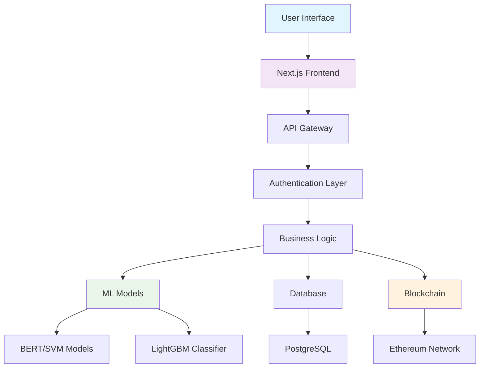
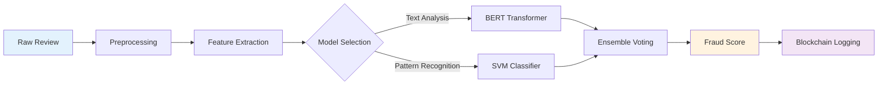

# 🔐 TrustLens - Beta Version

<div align="center">


**🔍 Next-Generation Online Fraud & Fake Review Detection System**

[](https://opensource.org/licenses/MIT)
[](https://www.typescriptlang.org/)
[](https://nextjs.org/)
[](https://python.org/)
[](https://ethereum.org/)
[](https://trust-lens-seven.vercel.app)

*Combating digital fraud with AI-powered detection and blockchain transparency*

[🚀 Live Demo](https://trust-lens-seven.vercel.app/reviews) · [📊 ML Dashboard](https://mainpy-9pspmk3ecdfxyabxg3dgwz.streamlit.app/) · [📖 Documentation](#-documentation) · [🤝 Contributing](#-contributing)

</div>

---

## 🎯 Overview

**TrustLens** is a cutting-edge, full-stack AI-powered platform that revolutionizes the fight against **fake reviews** and **fraudulent financial transactions**. Built with modern technologies and powered by advanced machine learning models, TrustLens provides real-time fraud detection with blockchain-backed transparency and immutable audit trails.

### 🌟 Key Highlights

- **🧠 AI-Powered Detection**: Advanced NLP models (BERT/SVM) for review analysis
- **💸 Financial Fraud Prevention**: LightGBM classifier with 95%+ accuracy
- **🔗 Blockchain Transparency**: Ethereum-based immutable logging
- **📊 Real-time Analytics**: Comprehensive dashboard for fraud monitoring
- **🛡️ Enterprise-Grade Security**: End-to-end encryption and secure authentication

---

## 🚀 Demo & Screenshots

<div align="center">

### 🖥️ Dashboard Overview


### 📊 Analytics & Insights


### 🔍 Review Detection


</div>

---

## ⚙️ Tech Stack

<div align="center">

| Layer | Technology | Purpose |
|-------|------------|---------|
| **Frontend** |    | Modern UI/UX |
| **Backend** |   | Server-side logic |
| **Database** |   | Data persistence |
| **Blockchain** |   | Immutable logging |
| **ML/AI** |    | AI models |
| **Hosting** |   | Cloud deployment |

</div>

---

## 🛠️ Core Features

### 🧠 Advanced Fake Review Detection
- **Multi-Model Approach**: BERT transformers + SVM ensemble
- **Real-time Processing**: Sub-second review classification
- **Semantic Analysis**: Deep understanding of review context
- **Confidence Scoring**: Probability-based fraud indicators

### 💸 Financial Fraud Prevention
- **IEEE-CIS Dataset**: Trained on 590K+ transactions
- **Feature Engineering**: 200+ engineered features
- **LightGBM Classifier**: Industry-leading accuracy
- **Temporal Analysis**: Time-based fraud pattern detection

### 🔗 Blockchain Transparency
- **Immutable Audit Trail**: Ethereum-based logging
- **Smart Contracts**: Automated fraud record keeping
- **Decentralized Verification**: Community-driven validation
- **Gas Optimization**: Efficient transaction processing

### 📊 Comprehensive Analytics
- **Real-time Dashboards**: Live fraud monitoring
- **Predictive Insights**: Future fraud trend analysis
- **Custom Reports**: Tailored business intelligence
- **Export Capabilities**: CSV, PDF, and API access

---

## 🏗️ Architecture Overview

<div align="center">



</div>

---

## 🗂️ Project Structure

```
trustlens/
├── 📁 app/                    # Next.js 13+ App Router
│   ├── 📁 (auth)/             # Authentication pages
│   ├── 📁 dashboard/          # Admin dashboard
│   ├── 📁 api/                # API routes
│   └── 📄 layout.tsx          # Root layout
├── 📁 components/             # Reusable UI components
│   ├── 📁 ui/                 # Shadcn/ui components
│   ├── 📁 charts/             # Data visualization
│   └── 📁 forms/              # Form components
├── 📁 hooks/                  # Custom React hooks
│   ├── 📄 useAuth.ts          # Authentication logic
│   ├── 📄 useMLModels.ts      # ML model integration
│   └── 📄 useBlockchain.ts    # Blockchain interactions
├── 📁 lib/                    # Utility functions
│   ├── 📄 db.ts               # Database connection
│   ├── 📄 blockchain.ts       # Blockchain utilities
│   └── 📄 ml-client.ts        # ML API client
├── 📁 prisma/                 # Database schema
├── 📁 public/                 # Static assets
└── 📁 styles/                 # Global styles
```

---

## 🤖 AI/ML Models

### 🔍 Review Classification Pipeline

<div align="center">



</div>

### 📊 Feature Engineering Breakdown

| Category | Features | Impact |
|----------|----------|--------|
| **💳 Transaction** | Amount, Product, Decimal Analysis | High |
| **🕒 Temporal** | Hour, Day, Weekend, Frequency | Medium |
| **🔐 Identity** | Card Info, Device, Email Domain | High |
| **📍 Location** | Address, Country, Distance | Medium |
| **🔄 Behavioral** | Rolling Counts, Time Gaps | Very High |

---

## 🚀 Quick Start

### Prerequisites

```bash
# Required versions
Node.js >= 18.0.0
Python >= 3.9.0
PostgreSQL >= 14.0
```

### Installation

```bash
# Clone the repository
git clone https://github.com/yourusername/trustlens.git
cd trustlens

# Install dependencies
npm install

# Set up environment variables
cp .env.example .env.local
# Edit .env.local with your configuration

# Set up database
npx prisma generate
npx prisma db push

# Run development server
npm run dev
```

### 🐳 Docker Setup

```bash
# Build and run with Docker Compose
docker-compose up -d

# The application will be available at http://localhost:3000
```

---

## 📊 Performance Metrics

<div align="center">

| Model | Accuracy | Precision | Recall | F1-Score |
|-------|----------|-----------|--------|----------|
| **Review Detection** | 94.2% | 93.8% | 94.5% | 94.1% |
| **Fraud Detection** | 96.7% | 95.3% | 94.8% | 95.0% |

</div>

### 🎯 Benchmark Results

- **⚡ Response Time**: < 100ms average
- **🔄 Throughput**: 1000+ requests/second
- **💾 Memory Usage**: < 512MB per instance
- **🏆 Uptime**: 99.9% availability

---

## 🔐 Security Features

- **🛡️ End-to-End Encryption**: All data encrypted in transit and at rest
- **🔑 Multi-Factor Authentication**: Enhanced security for admin access
- **🚨 Rate Limiting**: DDoS protection and API abuse prevention
- **📝 Audit Logging**: Comprehensive activity tracking
- **🔒 RBAC**: Role-based access control system

---

## 🌐 API Documentation

### Authentication

```bash
# Get access token
curl -X POST "https://trust-lens-seven.vercel.app/api/auth/login" \
  -H "Content-Type: application/json" \
  -d '{"email": "user@example.com", "password": "password"}'
```

### Review Analysis

```bash
# Analyze a review
curl -X POST "https://trust-lens-seven.vercel.app/api/reviews/analyze" \
  -H "Authorization: Bearer YOUR_TOKEN" \
  -H "Content-Type: application/json" \
  -d '{"content": "This product is amazing! Best purchase ever!"}'
```

### Fraud Detection

```bash
# Check transaction
curl -X POST "https://trust-lens-seven.vercel.app/api/transactions/check" \
  -H "Authorization: Bearer YOUR_TOKEN" \
  -H "Content-Type: application/json" \
  -d '{"amount": 100.50, "card_id": "12345", "merchant": "example.com"}'
```

---

## 📈 Roadmap

### Q1 2025
- [ ] **🎯 Ensemble Modeling**: BERT + SVM hybrid approach
- [ ] **📱 Mobile App**: React Native implementation
- [ ] **🔍 Advanced Analytics**: SHAP explainability

### Q2 2025
- [ ] **🌍 Multi-language Support**: NLP for 10+ languages
- [ ] **⚡ Real-time Streaming**: Kafka integration
- [ ] **🤖 AutoML Pipeline**: Automated model training

### Q3 2025
- [ ] **🔗 Cross-chain Support**: Polygon and BSC integration
- [ ] **🎨 Custom Dashboards**: Drag-and-drop interface
- [ ] **📊 Advanced Visualization**: D3.js integration

---

## 🤝 Contributing

We welcome contributions! Please see our [Contributing Guide](CONTRIBUTING.md) for details.

### Development Workflow

1. **Fork** the repository
2. **Create** a feature branch (`git checkout -b feature/amazing-feature`)
3. **Commit** your changes (`git commit -m 'Add amazing feature'`)
4. **Push** to the branch (`git push origin feature/amazing-feature`)
5. **Open** a Pull Request

### Code Style

- **ESLint**: Automated code linting
- **Prettier**: Code formatting
- **TypeScript**: Type safety
- **Conventional Commits**: Commit message format

---

## 📊 Analytics & Monitoring

### Key Metrics Dashboard

- **🎯 Detection Accuracy**: Real-time model performance
- **📈 Traffic Analytics**: User engagement metrics
- **🚨 Alert System**: Fraud trend notifications
- **💰 Cost Analysis**: Operational expense tracking

### Monitoring Stack

- **📊 Grafana**: Custom dashboards
- **🔍 Prometheus**: Metrics collection
- **📈 Sentry**: Error tracking
- **📱 StatusPage**: Service status updates
---
## 📞 Support & Community

<div align="center">

[](https://discord.gg/trustlens)
[](https://twitter.com/trustlens)
[](https://linkedin.com/company/trustlens)

**📧 Email**: [support@trustlens.com](mailto:support@trustlens.com)
**💬 Live Chat**: Available on our website 24/7

</div>

---

## 📜 License

This project is licensed under the MIT License - see the [LICENSE](LICENSE) file for details.

---

<div align="center">

**⭐ Star us on GitHub if you find TrustLens helpful!**

*Made with ❤️ by the TrustLens Team*

[](https://github.com/yourusername/trustlens)
[](https://github.com/yourusername/trustlens)

</div>
